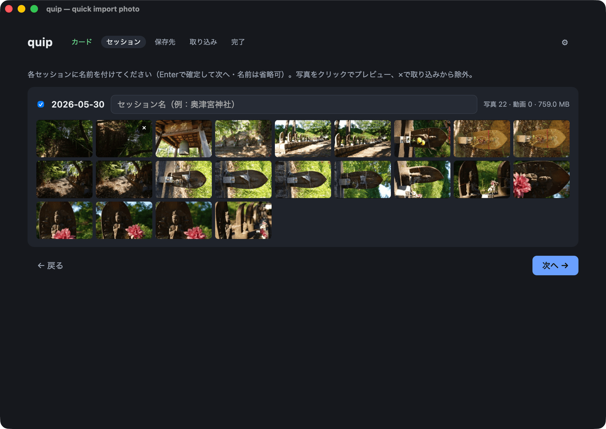

<p align="center">
  
</p>

<p align="center"><a href="README.md">English</a> | 日本語</p>

# quip

Quick import photo の略。カメラのSDカードから写真と動画を取り込み、撮影日ごとの
セッションにまとめ、検証済みのコピーとして写真アーカイブに整理する小さな
macOSアプリです。カードを挿す、名前付きフォルダができる、カードを空にする。
そのためだけの道具です。どのカメラも書き込む標準のDCIM構造を読み取り
（Sonyのビデオサイドカーがあればあわせて活用）、ただのメディアフォルダにも
対応します。動作確認は今のところmacOS Tahoeのみです。



## 取り込みの流れ

1. quipは`/Volumes`を監視し、`DCIM`フォルダを持つカードを一覧します。カードが
   1枚だけなら自動でスキャンし、何もマウントされていなければフォルダを手動で
   選べます。
2. 撮影日ごとにセッションへグループ化します（EXIF、SonyのXMLサイドカー、
   またはファイルのタイムスタンプ）。午前4時より前の撮影は前日の扱いになる
   ので、深夜をまたぐ撮影も1つのセッションにまとまります。各セッションに
   名前を付け（省略可・Enterで確定）、グループを結合したり、サムネイルの✕で
   除外したりできます。
3. 保存先を選びます（前回の場所を記憶）。各セッションは
   `{年}/{YYYY-MM-DD} {名前}/` に入ります。
4. すべてのファイルはコピーしながらblake3チェックサムを計算し、コピー後に
   保存先から読み戻して照合します。同名・同サイズのファイルは重複として
   スキップ、同名・別サイズは `name (2).ext` として残します。
5. 完了すると新しいフォルダがFinderで開き、検証済みファイルをカードから
   削除できます（macOSが残す`._*`ゴミやSonyのサイドカーも一緒に削除）。
   最後にカードを取り出して終了です。

設定は起動をまたいで保存されます。UIは英語と日本語の2言語対応で、システム
言語に従い、設定で切り替えられます。

## プロジェクト構成

Tauriアプリは、1つのリポジトリに2つのプログラムが同居する形です。ウィンドウを
所有して特権的な処理を担うRustバイナリ（`src-tauri/`）と、その中に描画される
Svelte 5 + TypeScriptフロントエンド（`src/`）。フロントエンドは`invoke()`で
Rustの関数を呼び、Rustはイベントで進捗を返します。

```
quip/
├── src/                        フロントエンド（SvelteKit SPA、bun）
│   ├── routes/+page.svelte     ウィザードの外枠とステップ切り替え
│   └── lib/
│       ├── api.ts              invoke()コマンドの型付きラッパー
│       ├── wizard.svelte.ts    共有状態（$stateルーン）と設定の保存
│       ├── i18n.svelte.ts      英語・日本語の文字列
│       └── components/         ウィザードの各ステップ（1ファイルずつ）
└── src-tauri/                  バックエンド（Rust）
    ├── tauri.conf.json         ウィンドウ、バンドルID、ビルドコマンド
    ├── capabilities/           webviewに許可する操作
    └── src/
        ├── volumes.rs          /Volumes監視、カード検出、取り出し
        ├── scan.rs             撮影日時の取得、セッションのグループ化
        ├── thumbs.rs           サムネイルキャッシュ（EXIF埋め込みの高速パス）
        └── import.rs           コピー、blake3検証、削除、Finderで表示
```

## 開発

bunとRustツールチェーン（`rustup`）が必要です。

```sh
bun install          # 初回のみ
bun run tauri dev    # ホットリロード付きで起動

cd src-tauri && cargo test    # Rustのユニット＋結合テスト
bun run check                 # svelte-check
```

## ビルド

`bun run tauri build` で `quip.app` と `.dmg` が
`src-tauri/target/release/bundle/` に生成されます。`.app` を
`/Applications` にドラッグするだけです。
